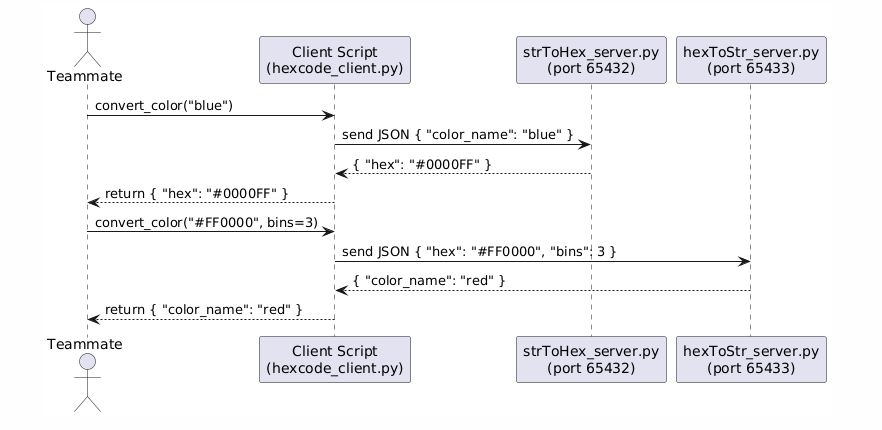

# Hexcode Microservice

I have created this microservice to convert between color names and hex codes. It supports:
- **Color name → Hex code** ('red' returns '#FF0000')
- **Hex code + Bins → Color name** ('#15DF4B' with 3 color bins returns 'green')

## Communication Contract

Your client must use **TCP sockets** to send a JSON-encoded request and receive a JSON-encoded response.
This requires running hexToStr_server.py and the StrToHex_server.py files **simultaneously in separate terminals**.

### 1. Request Format

#### Color Name → Hex (Port: 65432)

```json
{
  "color_name": "blue"
}
```

#### Hex Code → Color Name (Port: 65433)

```json
{
  "hex": "#00FF00",
  "bins": 3
}
```

> Bin count is required for hex-to-string conversion and determines which color bin mapping to use.
> Color bin information can be seen in /hex_to_str/colorBins.py

---

### 2. Response Format

#### Response for Color Name → Hex

```json
{
  "hex": "#0000FF"
}
```

#### Response for Hex → Color Name

```json
{
  "color_name": "green"
}
```

#### Error Response (e.g. missing bins or unknown name)

```json
{
  "error": "Bin count is required for hex-to-string conversion"
}
```

---

## Example Calls (Python)

```python
import socket, json

# establish the socket
def send_request(payload, port):
    with socket.socket(socket.AF_INET, socket.SOCK_STREAM) as s:
        s.connect(('localhost', port))
        s.sendall(json.dumps(payload).encode())
        return json.loads(s.recv(1024).decode())

# str to hex
print(send_request({"color_name": "red"}, 65432))  # {"hex": "#FF0000"}

# hex to str
print(send_request({"hex": "#FF0000", "bins": 3}, 65433))  # {"color_name": "red"}
```

---

## UML Sequence Diagram (PlantUML)


---
This image was created with PlantUML.com
